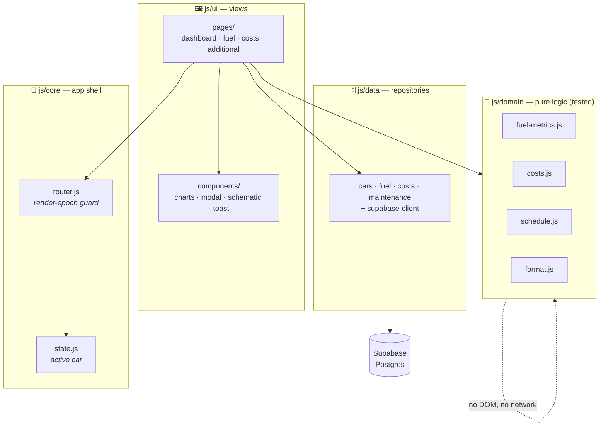
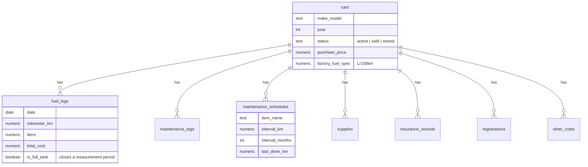

<div align="center">


<br>

**A blueprint-styled, offline-capable web app for tracking a car's fuel economy, running costs, and maintenance schedule — where every number is _measured_, not guessed.**

<br>


</div>

---

## Overview

Cars Manager is a single-page **Progressive Web App** for people who want to know the _real_ cost and efficiency of their car — not the sticker figure, but what the odometer and the receipts actually say. It runs entirely in the browser as native ES modules (no bundler, no framework), stores data in **Supabase (Postgres)**, and installs to the home screen like a native app.

The interface is built around an **engineer's-blueprint** aesthetic — deep navy field, amber hairlines, monospace annotations, and a schematic side-view of the car as the dashboard hero.

<div align="center">

|  🏠 Dashboard  |  ⛽ Fuel log  |  💶 Costs  |  🔧 Service |
|:---:|:---:|:---:|:---:|
| Live KPIs, efficiency trend, monthly spend, total cost of ownership | Ledger of every fill with per-leg L/100 km & €/100 km | Maintenance, supplies, insurance, registration & more — grouped by month | Recurring service schedule with overdue / due-soon status |

</div>

---

## Highlights

- **⛽ Honest fuel economy** — a rigorously-defined _forward attribution_ model (see below) turns messy real-world fill-ups into trustworthy L/100 km numbers.
- **🧮 Partial fills, handled properly** — top-ups don't corrupt your averages; they get flagged, per-leg estimates while full tanks give exact measurements.
- **💶 True cost of ownership** — purchase price **+** fuel **+** every recorded cost, not just the ones that are easy to add up.
- **📴 Offline-first PWA** — a service worker keeps the app usable without signal and installs it to your phone.
- **🧪 Unit-tested domain** — all the tricky math lives in pure, framework-free functions with **24 `node:test` tests**.
- **🚫 Zero build** — the source files _are_ the deploy artifact. Clone, serve, done.

---

## The fuel methodology

The interesting problem this app solves is: *given a pile of fuel receipts and odometer readings, what does the car actually consume?* The answer is subtler than it looks.

> **Forward attribution.** The fuel you add at a fill powers the distance you drive **until your next fill** — not the leg since the previous one. A fill's consumption is *its own* litres ÷ the leg to the *next* fill.

```
   fill A (full)          fill B (partial)        fill C (full)
      │                        │                       │
      ├────── leg A ──────────►├─────── leg B ────────►│
      │                        │                       │
   litres_A / km(A→B)      litres_B / km(B→C)      pending (no next fill yet)
   = measured L/100km      = flagged estimate       = no number yet
```

- **Full tanks** close a measurement period and yield an **exact** L/100 km.
- **Partial fills** get a **proportional leg estimate** (litres ÷ km × 100), shown as a `~x.x EST` pill and a hollow chart point — never silently averaged in.
- The **newest fill is "pending"**: its fuel is still in the tank, so it has no number until you fill again.
- Distance and monthly-spend stats stay **pure odometer & euro math** — estimates never leak into them.

Every rule here is documented and regression-tested in [`js/domain/fuel-metrics.js`](js/domain/fuel-metrics.js) and [`tests/fuel-metrics.test.js`](tests/fuel-metrics.test.js).

---

## Architecture

The code is layered so that the hard logic is pure and testable, and nothing above it can smuggle a DOM node or a network call into the math.



**Key design decisions**

| Decision | Why |
|---|---|
| **Render-epoch router** | Every navigation bumps an epoch; async page renders check `isStale(epoch)` after each `await` before touching the DOM — a slow response from a previous car can never draw a chart into a canvas that no longer exists. |
| **Pure domain layer** | No DOM, no Supabase — just numbers in, numbers out. This is what makes 24 fast unit tests possible without a browser. |
| **Numerics coerced at the boundary** | Supabase `numeric` columns arrive as strings; they're `Number()`-coerced once in the repo/normalize step so downstream math never sees a string. |
| **Hand-written CSS token system** | One `tokens.css` file is the single source of truth for the blueprint theme; no Tailwind, no CSS framework. |

---

## Project structure

```
cars-management/
├── index.html              # App shell: nav, FAB, modal, service-worker registration
├── manifest.json           # PWA manifest (installable, standalone, themed)
├── sw.js                   # Service worker — network-first, offline fallback
├── netlify.toml            # Redirects + cache headers (revalidate, never stale)
│
├── css/
│   ├── tokens.css          # 🎨 Design tokens — the blueprint theme source of truth
│   ├── base.css            # Resets, layout primitives
│   └── components.css      # Cards, ledger rows, pills, charts, nav
│
├── js/
│   ├── config.js           # Supabase URL + public anon key (single config point)
│   ├── main.js             # Bootstrap: load cars → pick active → start router
│   ├── core/               # router.js (epoch guard) · state.js
│   ├── data/               # Supabase repositories (queries only)
│   ├── domain/             # 🧮 Pure, unit-tested logic (fuel, costs, schedule, format)
│   └── ui/
│       ├── pages/          # dashboard · fuel · costs · additional
│       └── components/     # charts · modal · toast · car-header · car-schematic
│
├── supabase/
│   ├── schema.sql          # Full schema + seed (run once in the SQL editor)
│   └── migrations/         # Incremental changes
│
├── tests/                  # node:test suites (24 tests, no browser needed)
└── docs/                   # README assets
```

---

## Data model

Eight tables, all keyed to `cars`, cascade-deleted with the car they belong to.



Cost data is spread across several tables (`maintenance_logs`, `supplies`, `insurance_records`, `registrations`, `other_costs`) — each with its own date column — and unified for display in [`js/domain/costs.js`](js/domain/costs.js). Note that `insurance_records` uses `start_date`, not `date`; getting this wrong used to crash sorting, which is exactly the kind of thing the `COST_TYPES` map now centralises.

---

## Getting started

**Prerequisites:** Node.js (for the dev server & tests) and a free [Supabase](https://supabase.com) project.

```bash
# 1 — clone
git clone https://github.com/abdallah362728/cars-management.git
cd cars-management

# 2 — set up the database
#     open your Supabase project's SQL editor and run:
#       supabase/schema.sql
#     (creates all tables + seed rows)

# 3 — point the app at your project
#     edit js/config.js with your Supabase URL and public anon key

# 4 — run it locally
npm run dev          # serves at http://localhost:3000
```

> **On the anon key:** it's a *public* client-side key by design — row access is governed by Supabase Row-Level Security, not by hiding the key. It lives only in `js/config.js` so it can be swapped in one place.

### Testing

```bash
npm test             # node --test → 24 tests across fuel, costs, schedule
```

The suites run in plain Node with **no browser and no build** — because all the logic worth testing lives in the pure `js/domain/` layer.

### Deployment

The app deploys as static files (no build step). [`netlify.toml`](netlify.toml) is configured so that:

- the **service worker is never cached** (clients can't get stuck on an old one), and
- JS/CSS/HTML are always **revalidated** via ETag (`max-age=0, must-revalidate`) so a deploy shows up immediately instead of being served stale.

Point Netlify (or any static host) at the repository root and you're live.

---

## Tech stack

| Layer | Choice |
|---|---|
| **Frontend** | Vanilla JavaScript, native ES modules — no framework, no bundler |
| **Charts** | [Chart.js](https://www.chartjs.org/) 4.5.1 (pinned, via CDN) |
| **Styling** | Hand-written CSS with a custom-property token system |
| **Database** | Supabase (Postgres + RLS) |
| **PWA** | Web App Manifest + service worker |
| **Hosting** | Netlify (static, zero-build) |
| **Tests** | `node:test` (built-in) |

---

<div align="center">
<sub>Built with an odometer, a stack of fuel receipts, and a refusal to guess.</sub>
</div>
